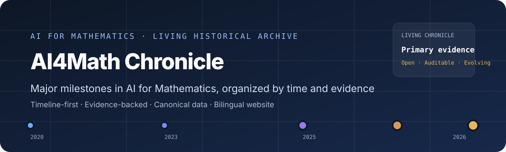

<p align="center">
  
</p>

<p align="center">
  <strong>English</strong> · <a href="./README.zh-CN.md">简体中文</a>
</p>

# AI4Math Chronicle

**AI4Math Chronicle** is a timeline-first, evidence-backed archive of major milestones in **AI for Mathematics**.

It is built for readers who want to understand how AI4Math has evolved, identify the most consequential milestones, and reach the strongest available evidence without reconstructing the history from scattered papers, announcements, repositories, benchmarks, and social posts.

> **Public site:** [AI4Math Chronicle](https://charlie-wang-03.github.io/ai4math-chronicle/en/)

## Start exploring

- **[Timeline](https://charlie-wang-03.github.io/ai4math-chronicle/en/)** — browse the full chronology from early neural theorem proving to research-level mathematical discovery.
- **[Explore events](https://charlie-wang-03.github.io/ai4math-chronicle/en/explore/)** — filter by year, event type, significance, and verification status.
- **[Methodology](https://charlie-wang-03.github.io/ai4math-chronicle/en/methodology/)** — understand inclusion, significance, evidence, verification, and correction policies.
- **[Data](https://charlie-wang-03.github.io/ai4math-chronicle/en/data/)** — access machine-readable JSON, NDJSON, schema, RSS, and sitemap outputs.

## What the Chronicle records

The v0.1 corpus contains **51 canonical events** spanning theorem proving, formalization, mathematical discovery, competition results, math-specific systems, benchmarks, datasets, and infrastructure.

Each event is designed to answer:

1. **What happened?**
2. **Why does it matter historically?**
3. **What did the AI system actually do?**
4. **What did humans contribute?**
5. **How strong is the verification?**
6. **Where is the primary evidence?**

The goal is not to reproduce a paper feed or model leaderboard. The Chronicle selects events that help explain the historical development of AI for Mathematics.

## Significance levels

The current corpus uses three editorial levels:

- **H1 — Historical Milestone:** a durable turning point in AI for Mathematics. Examples include major new mathematical results, landmark formalization achievements, and competition or research breakthroughs that materially change the historical picture.
- **H2 — Field Milestone:** an important advance in a mathematical AI subfield, system, benchmark, dataset, proof method, or infrastructure direction.
- **H3 — Context Event:** useful context that is not itself a substantive AI4Math milestone, such as a general-purpose reasoning model whose mathematical results mainly serve as capability evidence.

The current distribution is **11 H1 / 38 H2 / 2 H3**. Significance and verification are intentionally separate: an H1 event can still be under verification.

## Evidence and verification

Every published event must include at least one authoritative **S1 or S2** source.

| Tier | Source role |
| --- | --- |
| **S1** | Primary research record or artifact |
| **S2** | Official institutional or researcher source |
| **S3** | Independent scholarly verification or analysis |
| **S4** | Reputable secondary reporting |
| **S5** | Community discovery signal only |

Event pages separately expose claim status, evidence level, formal assurance, verification history, and corrections. `machine_checked` does not automatically mean `independently_verified`, and historical importance does not imply that a claim has been ratified as correct.

Read the full policy on the **[Methodology page](https://charlie-wang-03.github.io/ai4math-chronicle/en/methodology/)**.

## One event, one canonical record

A single canonical event record drives the timeline, event detail pages, filters, search, RSS, sitemap, and machine-readable exports.

```text
Canonical event
      │
      ├── Timeline and Explore
      ├── Event detail pages
      ├── Primary-evidence links
      ├── JSON / NDJSON / Schema
      ├── RSS
      └── Sitemap and structured metadata
```

This avoids maintaining multiple factual copies of the same historical event.

## Corrections and contributions

AI4Math Chronicle is intended to be auditable and correctable. If an event is missing, a source is weak, a translation is inaccurate, or a verification state needs revision, use the repository's structured issue forms.

- [Contributing guide](./CONTRIBUTING.md)
- [Editorial methodology](./docs/editorial-methodology.md)

Implementation details are intentionally separated from this website-oriented README. Developers should use the [Development Guide](./docs/development.md) and [Architecture](./docs/architecture.md).

## Licensing

The repository uses split licensing:

- **Source code:** MIT License.
- **Original Chronicle editorial content and data compilation:** Creative Commons Attribution 4.0 International (CC BY 4.0), within the scope described in [Content Licensing](./LICENSE-CONTENT.md).

Third-party papers, announcements, repositories, media, images, quotations, and external artifacts retain their original rights and are not relicensed merely because the Chronicle links to or cites them.

## Release status

AI4Math Chronicle v0.1 is prepared for public release. The repository remains private until the final launch review, after which the release branch can be merged, GitHub Pages verified, and repository visibility switched to public.
